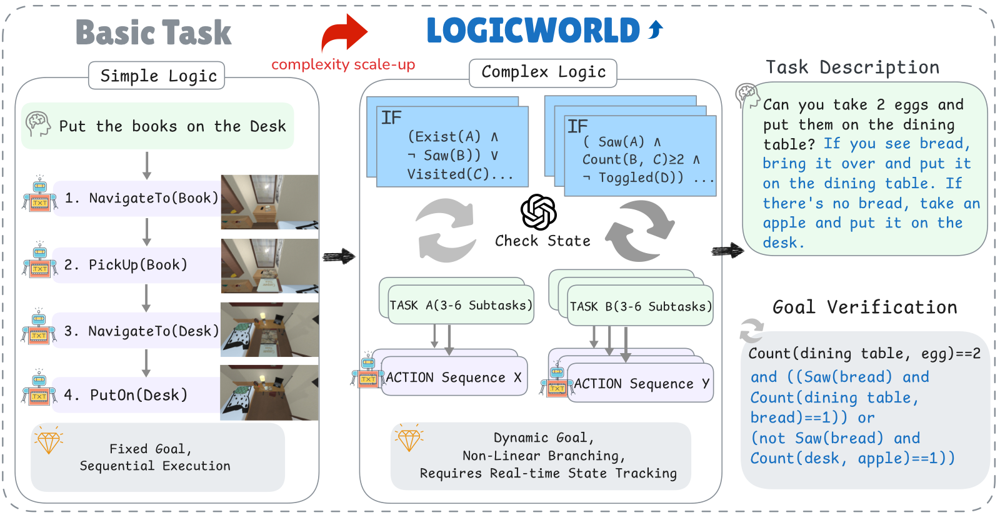
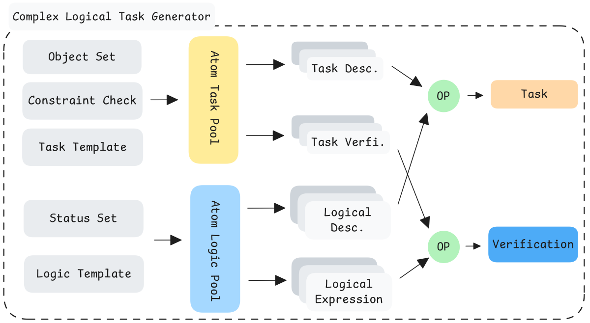

# LOGICWorld

**LOGICWorld: Automated Deep Logic Generation for Interactive Reasoning in Embodied Agents**

[English](README.md) | **中文**

<p align="center">
  
</p>

<p align="center">
  <em>从线性家居目标，走向深度命题逻辑、动态分支与自动目标验证。</em>
</p>

LOGICWorld 是一个面向具身智能体的认知评测框架与 Gymnasium 环境，用于检验智能体在**部分可观测**条件下能否维护逻辑状态机。不同于主要强调顺序操作的基准，LOGICWorld 会自动生成条件指令，例如：

> *如果冰箱里有可乐，就把它拿给我；否则去厨房把灯关掉。*

智能体必须主动探索环境、根据反馈更新信念、评估命题条件，并进行非线性重规划。

---

## 最新动态

- **2026-09-04 — 发布情景化任务数据。** 新增 `data/logicworld/test_v2.jsonl`，
  将 14 种任务类型的全部 1,182 条评测指令改写为自然情景，并在 `task_original`
  中保留原始指令。配套生成器支持约束感知提示、确定性规则检查、基于失败反馈的
  重试、断点续跑和审计元数据。发布数据已全部通过当前实现的规则检查；检查范围与
  注意事项见[情景化任务生成流程](#情景化任务生成流程)。

---

## 主要特性

- **认知能力阶梯** — 空间执行 → 状态追踪 → 组合推理
- **深度逻辑自动生成** — 自然语言任务与布尔验证函数成对生成
- **PROCTHOR 规模场景** — 1,000 测试 / 10,000 训练程序化家居，95 类可交互物体
- **高层动作原语** — 评测聚焦推理能力，而非底层运动控制
- **交互式 CLI** — 使用 `logicworld` 在终端中进行模拟

<p align="center">
  
</p>

<p align="center">
  <em>任务描述与验证函数合成流水线（原子任务 → 逻辑条件 → 组合 → 兜底分支）。</em>
</p>

---

## 认知框架

| 能力层级 | 评测重点 | 示例 |
|---|---|---|
| **空间执行 (Spatial Execution)** | 长程导航与技能串联 | Navigate、PickUp、Place、TurnOn/Off |
| **状态追踪 (State Tracking)** | 工作记忆、顺序约束、基础 `if-else` | Priority、Conditional、Multi-Goal |
| **组合推理 (Compositional Reasoning)** | 深度命题分支 | 含 `AND` / `OR` / `NOT` 的多分支表达式 |

组合推理层会合成自然语言指令，以及如下形式的全局验证式：

\[
T = \bigvee_{k=1}^{n}\big[f_k(c_{j_1},c_{j_2},\ldots;\mathcal{L}) \land g_k(V(t_a),V(t_b),\ldots;\mathcal{L})\big]
\]

其中 \(f_k\) 组合状态谓词（如 `Exist`、`Saw`、`Visited`），\(g_k\) 校验原子子任务是否完成。

**论文评测规模：** 共 1,182 个评测任务；仅组合推理层就包含 532 个逻辑任务，指令更长（约 201 tokens），谓词集合更密集。

---

## 安装

```bash
git clone https://github.com/iGangao/logicworld.git
cd logicworld
python -m venv .venv
source .venv/bin/activate   # Windows: .venv\Scripts\activate
pip install -e ".[dev]"
```

如需使用 `ASK` / `ANSWER` 相关 LLM 能力，可配置密钥：

```bash
cp .env.example .env
# 设置 LOGICWORLD_API_KEY / LOGICWORLD_BASE_URL / LOGICWORLD_MODEL
```

---

## 快速开始

### 交互式 CLI

```bash
logicworld --help
logicworld --house 0 --split test --seed 42
logicworld --auto-task pickup
```

```text
logicworld> help
logicworld> rooms
logicworld> NAVIGATE_TO('Kitchen_1')
logicworld> visible
logicworld> PICK_UP('Apple_1')
logicworld> DONE()
logicworld> quit
```

### Python API

```python
from logicworld import LOGICWorldEnv, load_scene

scene = load_scene("house_0", split="test")
env = LOGICWorldEnv(
    house="house_0",
    scene_data=scene,
    task={
        "task": "Search for any one apple and pick it up.",
        "verify": "self.hold('apple')",
        "task_type": "pickup",
    },
)

obs, info = env.reset(seed=42)
obs, reward, terminated, truncated, info = env.step("NAVIGATE_TO('Kitchen_1')")
```

Gymnasium：

```python
import gymnasium as gym
import logicworld  # noqa: F401
from logicworld import load_scene

env = gym.make(
    "LOGICWorld-v0",
    house="house_0",
    scene_data=load_scene("house_0", split="test"),
    task={"task": "demo", "verify": "True"},
)
```

更多示例见 [`examples/quickstart.py`](examples/quickstart.py)。

---

## 动作空间

高层技能原语（文本指令）：

| 动作 | 示例 |
|---|---|
| `NAVIGATE_TO` | `NAVIGATE_TO('Fridge_1')` |
| `OPEN` / `CLOSE` | `OPEN('Fridge_1')` |
| `PICK_UP` / `DROP` | `PICK_UP('Apple_1')` |
| `PUT_IN` / `PUT_ON` | `PUT_ON('Apple_1', 'CounterTop_1')` |
| `TURN_ON` / `TURN_OFF` | `TURN_ON('DeskLamp_1')` |
| `DONE` / `END` | `DONE()` / `END('impossible')` |
| `ASK` / `ANSWER` | `ASK('Where is the apple?')` |

环境为**部分可观测**：智能体需要打开容器、读取反馈，才能解析逻辑谓词并选择正确执行分支。

---

## 数据与配置

| 资源 | 路径 | 说明 |
|---|---|---|
| 训练场景 | `data/train.jsonl` | 10,000 个家居（**不入库**；约 331 MB，超过 GitHub 100 MB 限制） |
| 测试场景 | `data/test.jsonl` | 1,000 个评测家居（已跟踪） |
| 原始评测任务 | `data/logicworld/test.jsonl` | 1,182 条紧凑任务指令 |
| 情景化评测任务 | `data/logicworld/test_v2.jsonl` | 1,182 条情景化指令及生成审计元数据 |
| 物体可操作性 | `logicworld/configs/items.json` | placeable / openable / toggleable / pickable |
| 论文插图 | `papers/images/` | 概览图、任务生成器、消融实验等 |

> **说明：** 请将 `data/train.jsonl` 保留在本地（已写入 `.gitignore`）。CLI / 测试仅需 `data/test.jsonl`。详见 [`data/README.md`](data/README.md)。

```bash
export LOGICWORLD_DATA_DIR=/path/to/data
export LOGICWORLD_ITEMS_CONFIG=/path/to/custom_items.json
```

生成组合逻辑任务：

```bash
python scripts/generate_tasks.py \
  --split train \
  --min-rooms 3 \
  --max-rooms 6 \
  --limit 20 \
  --output outputs/conditional.jsonl
```

---

## 情景化任务生成流程

该流程把 `data/logicworld/test.jsonl` 中的紧凑指令改写为更自然、带动机的任务情景，
同时保持智能体需要完成的行为不变。发布结果位于 `data/logicworld/test_v2.jsonl`；
源数据不被覆盖，每条原始指令均复制到 `task_original`，便于追溯。

```text
原始 task + verify 表达式
            │
            ▼
约束感知的故事提示词
            │
            ▼
LLM 情景化改写
            │
            ▼
确定性规则校验 ── 失败 ──► 携带反馈重试（最多 3 次）
            │ 通过
            ▼
可断点续跑的 JSONL 输出 + 审计元数据
```

改写契约要求所有条件及兜底分支在智能体观测前保持未知，并精确保留对象名、数量、
动作顺序、容器关系、否定，以及“看到”与“到访”的区别。改写可以增加人物和动机，
但不得增删目标对象、动作或条件分支。

生成器按批次运行并支持断点续跑（默认追加到
`data/logicworld/test_stories.jsonl`）：

```bash
export OPENAI_API_KEY=...
export OPENAI_BASE_URL=...
python scripts/generate_stories.py --batch 10
```

每条输出均包含 `task_original`，以及记录重试次数、校验结果和源验证式异常标记的
`meta` 字段。发布数据覆盖 **14** 种任务类型，共 **1,182** 条，全部通过当前的
确定性规则检查，其中 **71** 条至少重试过一次。当前检查只覆盖可机械验证的约束，
尚不等同于完整逻辑等价证明；反向 DSL 抽取、符号等价校验、独立 LLM 评审和分层人工
抽检仍是后续质量保障工作。详细契约、实现状态、校验设计与风险见
[`pipeline.md`](docs/pipeline.md)。

---

## 仓库结构

```text
logicworld/
  cli.py              # 交互式终端模拟器
  env.py              # LOGICWorldEnv（Gymnasium）
  tasks.py            # TaskGenerator
  config.py           # 物体 / 容器配置加载
  configs/items.json
  paths.py
data/                 # 场景 JSONL
examples/             # 最小示例
scripts/              # 任务与情景故事生成脚本
docs/assets/          # README 插图
papers/
  LOGICWorld_IROS2026.tex
  LOGICWorld_IROS2026.pdf
  images/             # 论文插图（PDF）
tests/
```

---

## 开发

```bash
ruff check logicworld examples scripts tests
pytest -q
```

---

## 引用

如果本项目对你的研究有帮助，请引用：

```bibtex
@inproceedings{liu2026logicworld,
  title     = {LOGICWorld: Automated Deep Logic Generation for Interactive Reasoning in Embodied Agents},
  author    = {Liu, Gangao and Xu, Huixin and Wang, Mengna and Li, Peng},
  booktitle = {IEEE/RSJ International Conference on Intelligent Robots and Systems (IROS)},
  year      = {2026}
}
```

**作者：** Gangao Liu、Huixin Xu、Mengna Wang、Peng Li  
**通讯作者：** Peng Li（[lipeng@iscas.ac.cn](mailto:lipeng@iscas.ac.cn)）  
**单位：** 中国科学院软件研究所；中国科学院大学；南京邮电大学

---

## 许可证

本项目采用 [木兰宽松许可证第2版（MulanPSL-2.0）](http://license.coscl.org.cn/MulanPSL2)。

完整中英文文本见 [LICENSE](LICENSE)。

```text
Copyright (c) 2026 Gangao Liu, Huixin Xu, Mengna Wang, and Peng Li
LOGICWorld is licensed under Mulan PSL v2.
```
